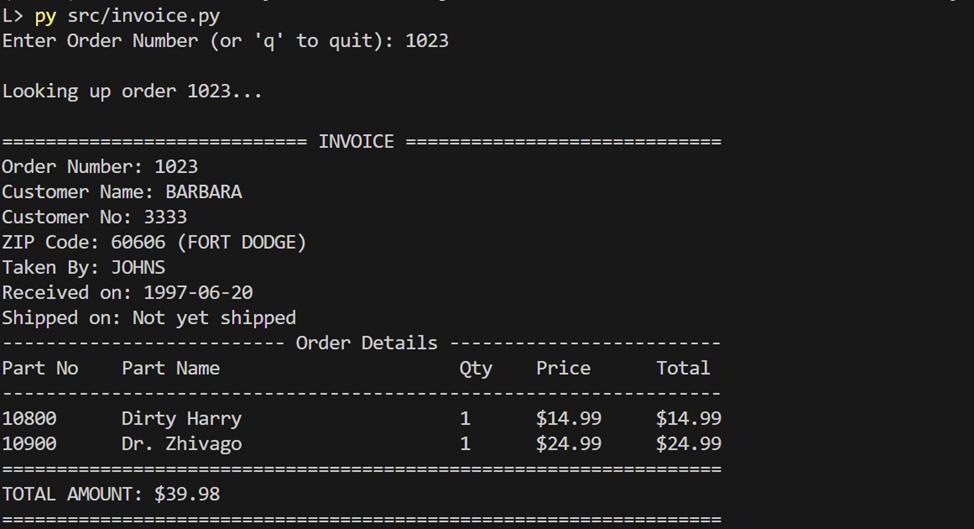
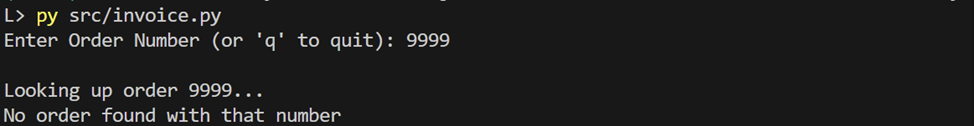

Python CLI application that displays customer order invoices using **Dynamic SQL** (parameterized queries) with MySQL

<table>
  <tr>
    <td><b>Order Found</b></td>
    <td></td>
  </tr>
  <tr>
    <td><b>Not Found</b></td>
    <td></td>
  </tr>
</table>

## Setup
**Requirements:** Python 3.7+, MySQL (local or google cloud SQL)

### 1. Clone
```
git clone https://github.com/Anisimov-AA/mail-order-invoice-DynamicSQL.git
```
```
cd mail-order-invoice-DynamicSQL
```

### 2. Setup environment
   
1. create virtual environment
```
py -m venv dbenv
```
2. activate it (you should see (dbenv) in prompt)
```
dbenv\Scripts\activate
```
3. install dependencies
```
pip install -r requirements.txt
```
4. when done, deactivate
```
deactivate
```

### 3. Setup Database

1. connect as root   
```bash
# choose one:
mysql -u root -p                              # local
mysql --host=[IP] --user=root --password      # remote
gcloud sql connect [instance] --user=root     # cloud SQL
```
   
2. create database and load schema
```sql
CREATE DATABASE mail_order;
USE mail_order;
source C:/.../sql/cr_mailorder.sql
```
   
3. verify tables
```sql
SHOW TABLES; -- should show 6 tables
```

4. create user and grant permissions to user
```sql
CREATE USER 'username' IDENTIFIED BY 'password';
GRANT ALL PRIVILEGES ON mail_order.* TO 'password';
```
   
5. exit
```sql
exit
```

### 4. Create `config/db_config.json`

```json
{
    "user": "username",
    "password": "password",
    "host": "cloud_sql_ip/localhost",
    "database": "mail_order"
}
```

### 5. Run
```
dbenv\Scripts\activate
```
```
py src/invoice.py
```
test with:: 1020, 1021, 1022, or 1023

## Project Structure
```
├── sql/
│   ├── cr_mailorder.sql              # database schema
│   └── get_invoice_by_order.sql      # invoice query
├── src/
│   ├── invoice.py                    # main application
│   └── test_invoice.py               # tests
└── config/
    └── db_config.json                # DB credentials (gitignored)
```

## Database Schema

The **mail_order** database contains 6 tables:

- **employees** - Employee information (eno, ename, zip, hdate)
- **parts** - Product catalog (pno, pname, qoh, prices, wlevel)
- **customers** - Customer information (cno, cname, street, zip, phone)
- **orders** - Order records (ono, cno, eno, received, shipped)
- **odetails** - Order line items (ono, pno, qty)
- **zipcodes** - ZIP to city mapping (zip, city)
